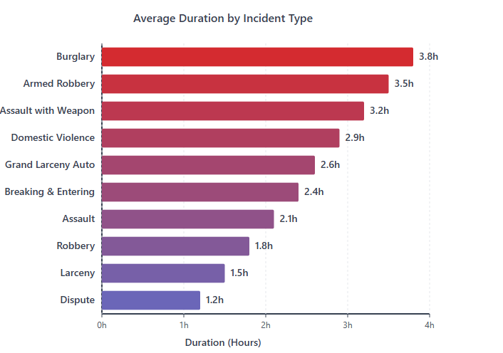
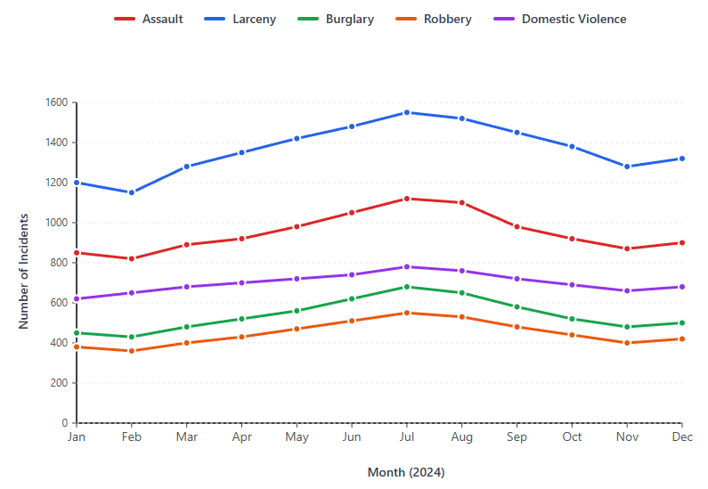
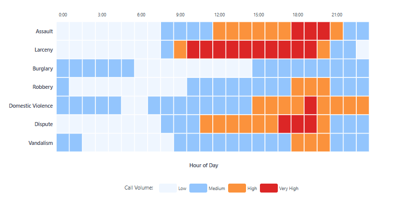

<!-- Questions and Findings - For each question:
Clear question statement
Polished D3 visualization
Analysis and interpretation
Insights and implications -->

# Temporal Analysis
<br>

## What is the average duration from call initiation to incident closure for the most common incident types? 

<br>

###  Possible Visualization: Horizontal bar chart showing top 10-15 radio codes with average total duration

<br>




</br>

### Loading the top 10 crime and potential crime category by median of call duration data processed using <a href="https://github.com/LaxmanSRawat/NovaSight/blob/main/temporal_analysis_top_10_category_by_average_total_duration.ipynb" rel="external">python jupyter notebook</a>

<br>

```js echo
// Load top 10 crime category by call duration data
const crime_top_10_categories_by_incident_duration = FileAttachment("nyc_data_crime_top_10_categories_by_call_duration.csv").csv({typed: true})
```

<br>

```js echo
crime_top_10_categories_by_incident_duration
```

<br>

```js echo

  // Set up dimensions
  const margin = { top: 40, right: 60, bottom: 60, left: 330 };
  const width = 900 - margin.left - margin.right;
  const height = 500 - margin.top - margin.bottom;

  // Group data by typ_desc
  const groupedData = d3.group(crime_top_10_categories_by_incident_duration, d => d.typ_desc);
  const boxPlotData = Array.from(groupedData, ([key, values]) => ({
    type: key,
    stats: calculateBoxPlotStats(values.map(d => d.call_duration_minutes)),
    values: values.map(d => d.call_duration_minutes)
  }));

  // Sort by median in descending order
  boxPlotData.sort((a, b) =>b.stats.median - a.stats.median);

  // Create SVG
  const svg = d3.create("svg")
    .attr("width", width + margin.left + margin.right)
    .attr("height", height + margin.top + margin.bottom)
    .attr("viewBox", [0, 0, width + margin.left + margin.right, height + margin.top + margin.bottom])
    .style("max-width", "100%")
    .style("height", "auto")
    .style("background", "#dfdfd6");

  const g = svg.append("g")
    .attr("transform", `translate(${margin.left},${margin.top})`);

  // Create scales (swapped x and y)
  const yScale = d3.scaleBand()
    .domain(boxPlotData.map(d => d.type))
    .range([0, height])
    .padding(0.3);

  const xScale = d3.scaleLinear()
    .domain([0, d3.max(boxPlotData, d => d3.max([d.stats.max, ...d.stats.outliers]))])
    .nice()
    .range([0, width]);

  console.log(d3.max(boxPlotData, d => d3.max([d.stats.max, ...d.stats.outliers])))

  // Create axes
  g.append("g")
    .attr("class", "x-axis")
    .attr("transform", `translate(0,${height})`)
    .call(d3.axisBottom(xScale))
    .selectAll("text")
    .style("font-size", "12px")
    .style("color", "white")
    .style("font-family", "Arial")
    .style("fill", "#000")
    .style("color", "#000");

  g.append("g")
    .attr("class", "y-axis")
    .call(d3.axisLeft(yScale))
    .selectAll("text")
    .style("font-size", "12px")
    .style("font-family", "Arial")
    .style("fill", "#000")
    .style("color", "#000");

  // Add axis labels
  g.append("text")
    .attr("text-anchor", "middle")
    .attr("x", width / 2)
    .attr("y", height + margin.bottom - 10)
    .style("font-size", "14px")
    .style("font-weight", "bold")
    .text("INCIDENT DURATION (MINUTES)")
    .style("fill", "#000")
    .style("font-family", "Arial");

  g.append("text")
    .attr("text-anchor", "middle")
    .attr("transform", "rotate(-90)")
    .attr("x", -height / 2)
    .attr("y", -margin.left + 15)
    .style("font-size", "14px")
    .style("font-weight", "bold")
    .text("INCIDENT TYPE")
    .style("fill", "#000")
    .style("font-family", "Arial");

  // Draw box plots
  const boxHeight = yScale.bandwidth();

  boxPlotData.forEach(d => {
    const y = yScale(d.type);
    const center = y + boxHeight / 2;

    const boxGroup = g.append("g");

    // Horizontal line from min to Q1
    boxGroup.append("line")
      .attr("x1", xScale(d.stats.min))
      .attr("x2", xScale(d.stats.q1))
      .attr("y1", center)
      .attr("y2", center)
      .attr("stroke", "#000")
      .attr("stroke-width", 1.5);

    // Horizontal line from Q3 to max
    boxGroup.append("line")
      .attr("x1", xScale(d.stats.q3))
      .attr("x2", xScale(d.stats.max))
      .attr("y1", center)
      .attr("y2", center)
      .attr("stroke", "#000")
      .attr("stroke-width", 1.5);

    // Min vertical line
    boxGroup.append("line")
      .attr("x1", xScale(d.stats.min))
      .attr("x2", xScale(d.stats.min))
      .attr("y1", center - boxHeight / 4)
      .attr("y2", center + boxHeight / 4)
      .attr("stroke", "#000")
      .attr("stroke-width", 1.5);

    // Max vertical line
    boxGroup.append("line")
      .attr("x1", xScale(d.stats.max))
      .attr("x2", xScale(d.stats.max))
      .attr("y1", center - boxHeight / 4)
      .attr("y2", center + boxHeight / 4)
      .attr("stroke", "#000")
      .attr("stroke-width", 1.5);

    // Box (IQR)
    boxGroup.append("rect")
      .attr("x", xScale(d.stats.q1))
      .attr("y", y)
      .attr("width", xScale(d.stats.q3) - xScale(d.stats.q1))
      .attr("height", boxHeight)
      .attr("fill", "steelblue")
      .attr("opacity", 0.7)
      .attr("stroke", "#000")
      .attr("stroke-width", 1);

    // Median line
    boxGroup.append("line")
      .attr("x1", xScale(d.stats.median))
      .attr("x2", xScale(d.stats.median))
      .attr("y1", y)
      .attr("y2", y + boxHeight)
      .attr("stroke", "#000")
      .attr("stroke-width", 2);

    // Outliers
    d.stats.outliers.forEach(outlier => {
      boxGroup.append("circle")
        .attr("cx", xScale(outlier))
        .attr("cy", center)
        .attr("r", 3)
        .attr("fill", "#e74c3c")
        .attr("opacity", 0.6);
    });
  });

  display(svg.node());
```

<br>

## How have 911 call volumes and incident types changed over the year? 

### Possible Visualization:  Time series line chart showing monthly trends by major incident category 

<br>



<br>

## How does the distribution of call types vary throughout the day? 


</br>

### Loading the count of incident date grouped by incident date data processed using <a href="https://github.com/LaxmanSRawat/NovaSight/blob/main/temporal_analysis_count_incident_agg_by_date.ipynb" rel="external">python jupyter notebook</a>

<br>

```js echo
// Load top 10 crime category by call duration data
const crime_data = FileAttachment("count_crime_type_by_date.csv").csv({typed: true})
```

<br>

```js echo
crime_top_10_categories_by_incident_duration
```

```js echo

  // Specify the chart’s dimensions.
  const width = 928;
  const height = 600;
  const marginTop = 20;
  const marginRight = 20;
  const marginBottom = 30;
  const marginLeft = 30;

  // Create the positional scales.
  const x = d3.scaleUtc()
    .domain(d3.extent(crime_data, d => d.incident_date))
    .range([marginLeft, width - marginRight]);

  const y = d3.scaleLinear()
    .domain([0, d3.max(crime_data, d => d.count)]).nice()
    .range([height - marginBottom, marginTop]);

  // Create the SVG container.
  const svg = d3.create("svg")
      .attr("width", width)
      .attr("height", height)
      .attr("viewBox", [0, 0, width, height])
      .attr("style", "max-width: 100%; height: auto; overflow: visible; font: 10px sans-serif;")
      .style("background","#dfdfd6");

  // Add the horizontal axis.
  svg.append("g")
      .attr("transform", `translate(0,${height - marginBottom})`)
      .call(d3.axisBottom(x).ticks(width / 80).tickSizeOuter(0))
      .style("fill","#000")
      .style("color","#000");

  // Add the vertical axis.
  svg.append("g")
      .attr("transform", `translate(${marginLeft},0)`)
      .call(d3.axisLeft(y))
      .call(g => g.select(".domain").remove())
      .style("fill","#000")
      .style("color","#000")
      .call(g => g.append("text")
          .attr("x", -marginLeft)
          .attr("y", 10)
          .attr("fill", "currentColor")
          .attr("text-anchor", "start")
          .text("↑ Count of Incident"));


  // Compute the points in pixel space as [x, y, z], where z is the name of the series.
  const points = crime_data.map((d) => [x(d.incident_date), y(d.count), d.typ_desc]);
  console.log(points)

  // Group the points by series.
  const groups = d3.rollup(points, v => Object.assign(v, {z: v[0][2]}), d => d[2]);

  // Draw the lines.
  const line = d3.line();
  const path = svg.append("g")
      .attr("fill", "none")
      .attr("stroke", "steelblue")
      .attr("stroke-width", 1.5)
      .attr("stroke-linejoin", "round")
      .attr("stroke-linecap", "round")
    .selectAll("path")
    .data(groups.values())
    .join("path")
      .style("mix-blend-mode", "multiply")
      .attr("d", line);

  // Add an invisible layer for the interactive tip.
  const dot = svg.append("g")
      .attr("display", "none");

  dot.append("circle")
      .attr("r", 2.5);

  dot.append("text")
      .attr("text-anchor", "middle")
      .attr("y", -8);

  svg
      .on("pointerenter", pointerentered)
      .on("pointermove", pointermoved)
      .on("pointerleave", pointerleft)
      .on("touchstart", event => event.preventDefault());

   display(svg.node());

  // When the pointer moves, find the closest point, update the interactive tip, and highlight
  // the corresponding line.
  
  function pointermoved(event) {
    const [xm, ym] = d3.pointer(event);
    const i = d3.leastIndex(points, ([x, y]) => Math.hypot(x - xm, y - ym));
    const [x, y, k] = points[i];
    path.style("stroke", ({z}) => z === k ? null : "#ddd").filter(({z}) => z === k).raise();
    dot.attr("transform", `translate(${x},${y})`);
    dot.select("text").text(k);
    svg.property("value", crime_data[i]).dispatch("input", {bubbles: true});
  }

  function pointerentered() {
    path.style("mix-blend-mode", null).style("stroke", "#ddd");
    dot.attr("display", null);
  }

  function pointerleft() {
    path.style("mix-blend-mode", "multiply").style("stroke", null);
    dot.attr("display", "none");
    svg.node().value = null;
    svg.dispatch("input", {bubbles: true});
  }

```

### Possible Visualization: heatmap showing incident categories by hour of day

<br>



#### Appendix


```js echo
// Helper Function for IQR
function calculateBoxPlotStats(values) {
            const sorted = values.sort(d3.ascending);
            const q1 = d3.quantile(sorted, 0.25);
            const median = d3.quantile(sorted, 0.5);
            const q3 = d3.quantile(sorted, 0.75);
            const iqr = q3 - q1;
            const min = d3.max([d3.min(sorted), q1 - 1.5 * iqr]);
            const max = d3.min([d3.max(sorted), q3 + 1.5 * iqr]);
            
            const outliers = sorted.filter(v => v < q1 - 1.5 * iqr || v > q3 + 1.5 * iqr);
            
            return { q1, median, q3, min, max, outliers };
        }
```
